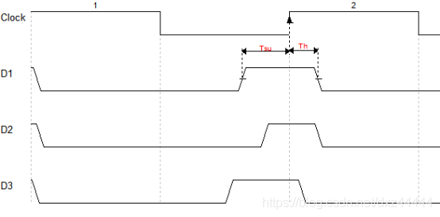
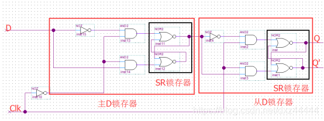

# 觸發器的建立時間和保持時間

- 建立時間, 因為上升沿打開開關需要時間，邏輯門的狀態改變（電容充放電等）都需要時間，因此數據的採集是需要一定時間的  
此期間不能發生部正確的數值變化
- 保持時間, 係因DFF有主從結構,
若訊號保持不夠久, 從latch獲得的訊號可能不是正確的  

ref: https://blog.csdn.net/dxz44444/article/details/104554391